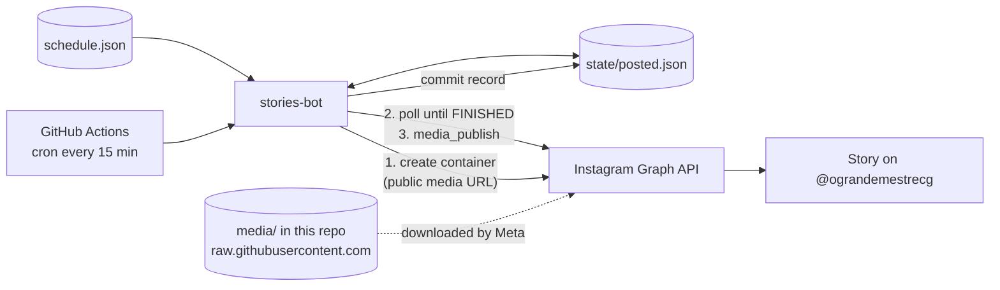

# O Grande Mestre — Instagram Stories Automation

[](https://github.com/pedroalmeidapeixoto/O-Grande-Mestre-Posts/actions/workflows/ci.yml)


🇬🇧 English · [🇧🇷 Português](#-português-br)

A small, production-running bot that publishes **Instagram Stories on a weekly schedule** for my family's restaurant, [@ograndemestrecg](https://www.instagram.com/ograndemestrecg/). It uses the official **Instagram Graph API** and runs entirely on **GitHub Actions**: no server, no paid scheduler, no third-party SaaS.

## Features

- **Weekly schedule as data**: days, local time and media file live in `schedule.json`; changing a post is a commit.
- **Serverless**: GitHub Actions cron triggers the bot every 15 minutes; the repository itself hosts the media.
- **Idempotent**: each Story is published once per day, even if the cron fires late, twice or overlaps.
- **Tolerant to cron jitter**: a slot stays eligible for a configurable window (default 30 min) and still fires correctly across midnight.
- **Safe by design**: credentials come only from environment variables / GitHub Secrets, and error messages never include the request URL, so the token cannot leak into logs.
- **Tested and typed**: 41 tests, `ruff`, strict `mypy`, CI on Python 3.10–3.12.

## How it works



1. The bot loads `schedule.json` and decides which slots are **due now** (inside their window and not yet recorded in `state/posted.json`).
2. For each one it creates a `STORIES` media container pointing to the file's public GitHub URL, waits for Meta to finish processing, then publishes it.
3. The publish record is committed back to the repository so the next run knows what already went out.

### Design decisions

| Decision | Why |
|---|---|
| GitHub as media host (public repo) | The Graph API only accepts a public URL. This removes a whole extra service (S3/Cloudinary) at the cost of a public repo, which is fine for content that is published anyway. |
| Window instead of exact-time match | GitHub cron can be delayed by minutes. A window plus an idempotency key gives at-most-once publishing without a database. |
| State file committed to the repo | Free, auditable persistence; atomic writes avoid half-written files. |
| Credentials required lazily | Dry runs, tests and "nothing due" runs need no secrets, which keeps CI simple and safe. |
| User token + granular scopes for ids | Pages managed by a business portfolio don't show up in `me/accounts`; `stories-token` reads the ids granted to the token instead. |

## Quick start

```bash
git clone https://github.com/pedroalmeidapeixoto/O-Grande-Mestre-Posts.git
cd O-Grande-Mestre-Posts
python -m venv .venv && source .venv/bin/activate   # Windows: .venv\Scripts\Activate.ps1
pip install -e ".[dev]"

pytest                                              # run the test suite
cp schedule.example.json schedule.json              # then edit it
stories-bot --dry-run --now 2026-10-09T18:05        # preview what would be published
```

### Schedule format

```json
{
  "timezone": "America/Sao_Paulo",
  "window_minutes": 30,
  "stories": [
    { "days": ["fri", "sat"], "time": "18:00", "file": "weekend-promo.jpg" }
  ]
}
```

`days` use `mon tue wed thu fri sat sun`. Files live in [`media/`](media/): images are JPG/PNG at 1080×1920, videos MP4/MOV up to 60 s.

## Setup for your own account

1. **Instagram**: a Professional (Business/Creator) account linked to a Facebook Page.
2. **Meta app**: create a Business app at [developers.facebook.com](https://developers.facebook.com), add the use case *Manage messaging & content on Instagram*, and in the [Graph API Explorer](https://developers.facebook.com/tools/explorer) generate a user token with `instagram_basic`, `instagram_content_publish`, `pages_show_list`, `pages_read_engagement`, selecting your Page and Instagram account.
3. **Long-lived token**: run `stories-token` and paste the App ID, App Secret and the short token. It prints the `IG_USER_ID` and a ~60-day `IG_ACCESS_TOKEN`. Nothing is written to disk.
4. **GitHub**: create a **public** repository from this code and add two secrets (*Settings → Secrets and variables → Actions*): `IG_USER_ID` and `IG_ACCESS_TOKEN`.
5. Add artwork to `media/`, fill `schedule.json`, push. The `Publish Stories` workflow does the rest; you can also run it manually from the *Actions* tab.

> **Token renewal:** long-lived tokens expire after ~60 days. Generate a new short token, run `stories-token` again and update the `IG_ACCESS_TOKEN` secret. A failed run shows up as a red workflow and a GitHub email.

## Limitations

- The API cannot add interactive stickers (poll, link, mention). Put any text inside the artwork.
- The repository must be public so Meta can fetch the media.
- GitHub may delay scheduled runs, and it can pause scheduled workflows in repositories with no activity for 60 days; a manual run re-enables them.

## Project layout

```
src/stories_bot/
  schedule.py     parse + validate schedule, decide what is due
  instagram.py    Graph API client (container → poll → publish)
  state.py        atomic record of published Stories
  config.py       environment-based settings, public media URLs
  cli.py          `stories-bot` entry point
  token_setup.py  `stories-token` helper
tests/            pytest suite (HTTP mocked with `responses`)
.github/workflows/
  ci.yml          ruff, mypy, pytest on Python 3.10–3.12
  stories.yml     scheduled publisher
```

## Development

```bash
ruff check . && ruff format --check .   # lint + formatting
mypy                                    # strict type checking
pytest                                  # tests + coverage
```

## License

[MIT](LICENSE) © Pedro Henrique de Almeida Peixoto

---

# 🇧🇷 Português (BR)

Bot que publica **Stories no Instagram em horários semanais** para o restaurante da minha família, o [@ograndemestrecg](https://www.instagram.com/ograndemestrecg/). Usa a **API oficial do Instagram (Graph API)** e roda inteiro no **GitHub Actions**: sem servidor, sem agendador pago, sem SaaS de terceiros.

## Destaques

- **Agenda como dados**: dias, horário local e arquivo ficam em `schedule.json`; mudar um post é um commit.
- **Serverless**: o cron do GitHub Actions dispara o bot a cada 15 minutos; o próprio repositório hospeda as artes.
- **Idempotente**: cada Story sai uma vez por dia, mesmo que o cron atrase, dispare duas vezes ou se sobreponha.
- **Tolerante a atrasos do cron**: cada horário vale por uma janela configurável (padrão 30 min), inclusive na virada do dia.
- **Seguro por padrão**: credenciais só vêm de variáveis de ambiente / GitHub Secrets, e as mensagens de erro nunca incluem a URL da requisição, então o token não vaza nos logs.
- **Testado e tipado**: 41 testes, `ruff`, `mypy` estrito e CI em Python 3.10–3.12.

## Como funciona

1. O bot lê o `schedule.json` e decide quais horários estão **devidos agora** (dentro da janela e ainda não registrados em `state/posted.json`).
2. Para cada um, cria um container `STORIES` apontando para a URL pública do arquivo no GitHub, espera a Meta processar e publica.
3. O registro da publicação é commitado de volta no repositório, para a próxima execução saber o que já foi.

O diagrama e a tabela de decisões de design estão na seção em inglês acima.

## Uso rápido

```bash
git clone https://github.com/pedroalmeidapeixoto/O-Grande-Mestre-Posts.git
cd O-Grande-Mestre-Posts
python -m venv .venv && .venv\Scripts\Activate.ps1
pip install -e ".[dev]"

pytest
copy schedule.example.json schedule.json
stories-bot --dry-run --now 2026-10-09T18:05
```

Dias aceitos: `mon tue wed thu fri sat sun`. As artes ficam em [`media/`](media/): imagens JPG/PNG 1080×1920, vídeos MP4/MOV de até 60 s.

## Configuração para sua conta

1. **Instagram** profissional (Business/Creator) ligado a uma Página do Facebook.
2. **App na Meta**: crie um app Business em [developers.facebook.com](https://developers.facebook.com), adicione o caso de uso *Gerenciar mensagens e conteúdo no Instagram* e gere, no [Explorador da Graph API](https://developers.facebook.com/tools/explorer), um token com `instagram_basic`, `instagram_content_publish`, `pages_show_list` e `pages_read_engagement`, escolhendo a Página e a conta do Instagram.
3. **Token de longa duração**: rode `stories-token` e informe App ID, App Secret e o token curto. Ele imprime o `IG_USER_ID` e um `IG_ACCESS_TOKEN` de ~60 dias. Nada é gravado em disco.
4. **GitHub**: crie um repositório **público** com este código e cadastre dois secrets (*Settings → Secrets and variables → Actions*): `IG_USER_ID` e `IG_ACCESS_TOKEN`.
5. Coloque as artes em `media/`, preencha o `schedule.json` e faça push. O workflow `Publish Stories` cuida do resto; também dá para rodá-lo manualmente na aba *Actions*.

> **Renovação do token:** tokens de longa duração expiram em ~60 dias. Gere um novo token curto, rode `stories-token` de novo e atualize o secret `IG_ACCESS_TOKEN`.

## Limitações

- A API não permite stickers interativos (enquete, link, menção): coloque o texto dentro da arte.
- O repositório precisa ser público para a Meta conseguir baixar as mídias.
- O GitHub pode atrasar execuções agendadas e pausar workflows de repositórios sem atividade por 60 dias; uma execução manual reativa.

## Licença

[MIT](LICENSE) © Pedro Henrique de Almeida Peixoto
